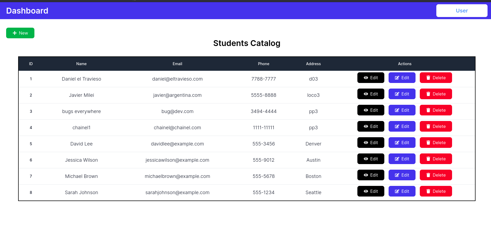

# CRUD model #

## Version 0.0.1 ##
* Project Point of start
* Focused on persistence and basic funcionality
* Oriented to the dev
* Backend: json-server

### Screen shots ###
- 
- 
- 
- 
- 

## Version 0.0.2 ##
* Clean code (SOLID)
* Redux for state managament
* UI improvement
* Data input validation
* Oriented to production
* Backend: json-server

### Screen shots ###
- 
- 
- 
- 
- 

## References ##

* [Tailwind original tutorial](https://www.youtube.com/watch?v=l2TX7Pn9XNg&list=PLsQR_Tmsj29l23rFGEW1EYHINeB-IRDFm&index=1&t=3654s).
* [Useful React video tutorials](https://www.youtube.com/@ReactDeveloper/videos)
* [Confirmation Dialog component](https://www.youtube.com/watch?v=dEGbXY-8YtU)
